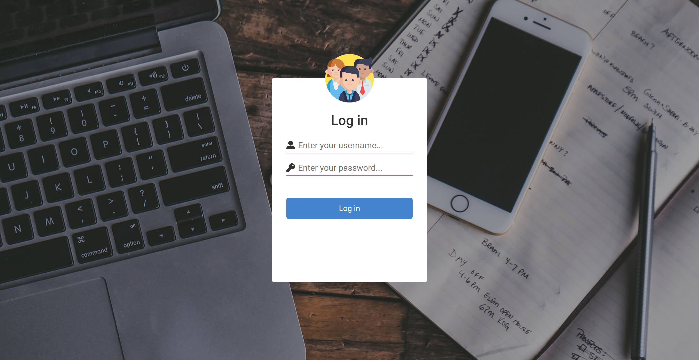

# Employee Attendance System

PHP-based website that was built to help companies keep track of employees' attendance.
 

The website is in Indonesian language.

# Steps to clone repository

1. Click on `<> Code` button
2. Copy the HTTPS/SSH repository link
3. Run `git clone` command on your terminal.
4. Import the database using `.sql` script provided.
5. Open the website on your localhost.

## Key Features

- Check-in system for employee
- Attendance dashboard
- Managing employees' data
- Managing employees' shift
- Managing employees' department
- Print out absent report for a specific period of time.

## Screenshots

**Login Screen**

**Employee Attendance Screen**

**Admin Dashboard Screen**

**Employee List Screen**

**Employee Attendance Report Screen**

 

> This is a website that I made for my college studies.
